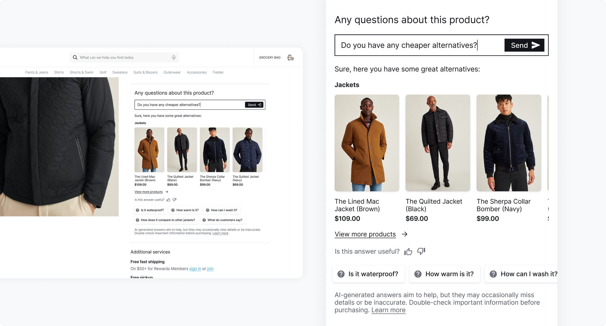

<div align="center">
  
  
  <h1>AI Shopping Assistant PDP UI library</h1>

  <p align="center" style="font-size: 1.2rem;">ASA PDP is an NLP chatbot embedded in product detail pages, designed to answer key technical product questions essential for final purchase decisions.</p>

[**Read The Docs**](https://constructor-io.github.io/constructorio-ui-asa-pdp)

</div>

<hr />
<div align="center">


[](https://www.npmjs.com/package/@constructor-io/constructorio-ui-asa-pdp)
[](https://github.com/Constructor-io/constructorio-ui-asa-pdp/blob/main/LICENSE)



</div>

## Installation

```bash
npm i @constructor-io/constructorio-ui-asa-pdp
```

## Usage

### Using the JavaScript Bundle

This is a framework agnostic method that can be used in any JavaScript project. The `CioAsaPdp` function provides a simple interface to inject the ASA PDP component into the provided `selector`.

In addition to [ASA PDP component props](https://constructor-io.github.io/constructorio-ui-asa-pdp/?path=/docs/components-cioasapdp--docs), this function also accepts `selector` and `includeCSS`.

```js
import CioAsaPdp from '@constructor-io/constructorio-ui-asa-pdp/constructorio-ui-asa-pdp-bundled';

CioAsaPdp({
  selector: '#asa-pdp-container',
  includeCSS: true, // Include the default CSS styles - defaults to true
  apiKey: 'key_M57QS8SMPdLdLx4x',
  itemId: '12345',
});
```

## Requirements

- Node.js v18.20.3 (LTS Hydrogen)
- React >=16.12.0
- React DOM >=16.12.0

## License

MIT © Constructor.io
